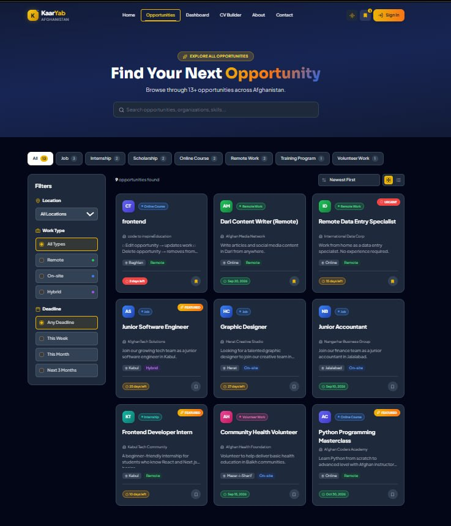
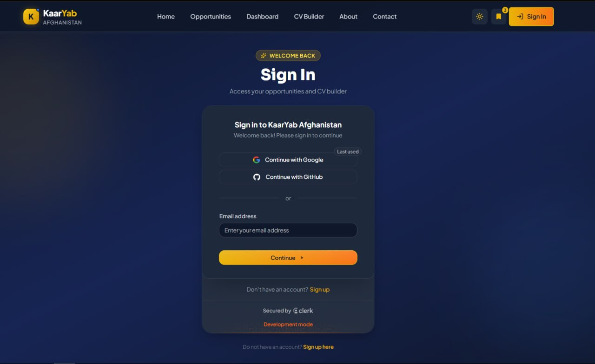
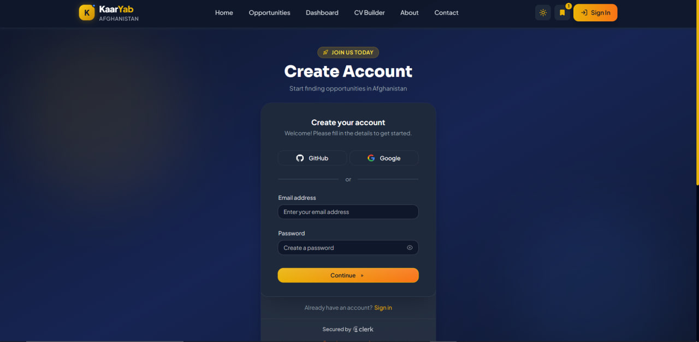
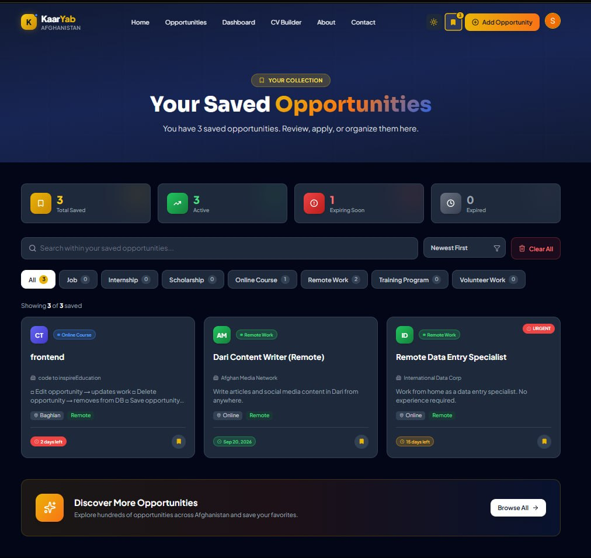
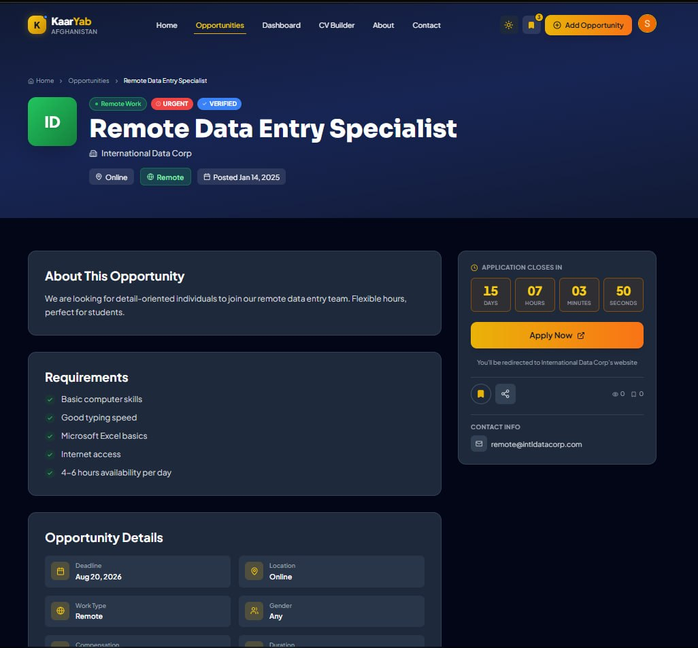
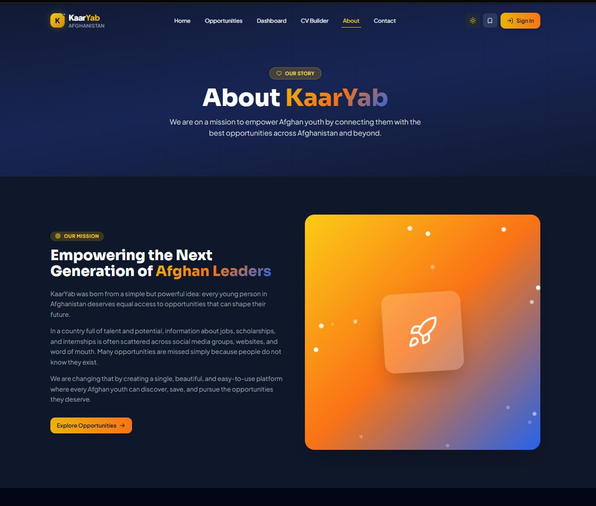
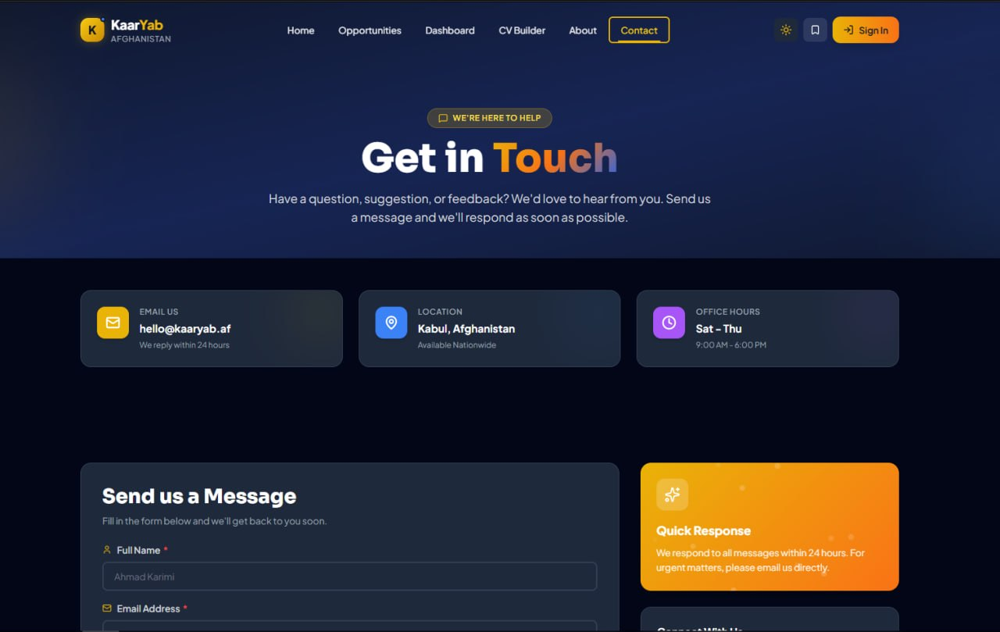

# 🇦🇫 KaarYab Afghanistan

> **Opportunity Finder Platform for Afghan Youth**

A modern full-stack web application that connects Afghan youth with
jobs, scholarships, internships, remote work, training programs,
volunteer opportunities, and skill-building resources across
Afghanistan.
[](https://github.com/Somaiyanoori/kaaryab-afghanistan/actions/workflows/ci.yml)
[](https://kaaryab-afghanistan-seven.vercel.app/)
[](https://github.com/Somaiyanoori/kaaryab-afghanistan)
[](LICENSE)

[](https://nextjs.org/)
[](https://react.dev/)
[](https://tailwindcss.com/)
[](https://supabase.com/)
[](https://clerk.com/)

---

## Live Demo

> ### **[Visit KaarYab Afghanistan →](https://kaaryab-afghanistan-seven.vercel.app/)**

Try it now! Sign up with your email to explore all features.

---

## Overview

**KaarYab Afghanistan** is designed to make educational and career
opportunities more accessible for Afghan youth. The platform allows
users to discover opportunities, manage their applications, and create
professional CVs within a modern and responsive web interface.

### Problem It Solves

In Afghanistan, opportunities for education, employment, and skill
development are often scattered across multiple platforms in different
languages. Many young Afghans miss valuable chances simply because they
don't know where to look. KaarYab centralizes all these opportunities in
one beautiful, accessible platform.

### Target Users

- Afghan youth searching for jobs and internships
- Students looking for scholarships
- Professionals seeking remote work
- Organizations posting opportunities
- Anyone wanting to build a professional CV

---

## Features

### Authentication

- Secure authentication using **Clerk**
- Email/password registration and login
- Protected routes for authenticated users
- User profile management with avatar
- Theme-aware authentication pages
- Session management

### Opportunities Management

- Browse **7 categories** of opportunities:
  - Jobs
  - Scholarships
  - Internships
  - Remote Work
  - Online Courses
  - Training Programs
  - Volunteer Opportunities
- Advanced search with real-time results
- Filter by:
  - Category
  - Location (all Afghan provinces + Online)
  - Work type (Remote / On-site / Hybrid)
  - Deadline (This week / This month / Next 3 months)
- Sort by newest, oldest, deadline, or popularity
- Save favorite opportunities (synced across devices)
- Live deadline countdown timer
- Grid and List view modes

### Dashboard

- Personal analytics dashboard
- Real-time opportunity statistics
- Interactive charts (Recharts)
- Recent submissions timeline
- "Expiring Soon" alerts
- Manage your posted opportunities
- Edit and delete with confirmation

### CV Builder

- **4 professional templates**:
  - Modern (two-column with blue accents)
  - Classic (traditional serif)
  - Minimal (elegant with yellow accents)
  - Professional (dark sidebar)
- Live preview as you type
- Comprehensive sections:
  - Personal Information
  - Work Experience
  - Education
  - Skills (with levels)
  - Languages (with proficiency)
  - Projects
  - Certifications
- Sample data for quick start
- **Download as PDF** with one click
- Mobile-friendly with tab switching

### User Experience

- Fully responsive design (Mobile / Tablet / Desktop)
- Dark mode and Light mode
- Smooth animations with Framer Motion
- Loading skeletons for better UX
- Empty states with helpful messages
- Comprehensive error handling
- WCAG accessible interface
- Toast notifications for feedback

---

## Tech Stack

### Frontend

Category Technology

---

**Framework** Next.js 14 (App Router)
**UI Library** React 19
**Language** JavaScript
**Styling** Tailwind CSS 3
**Animations** Framer Motion
**Icons** Lucide React, React Icons
**Charts** Recharts

### Backend & Database

Category Technology

---

**Database** Supabase (PostgreSQL)
**Authentication** Clerk
**API** Supabase Client

### Development Tools

Category Technology

---

**State Management** Zustand
**Forms** React Hook Form + Zod
**PDF Generation** jsPDF + html2canvas
**Testing** Vitest, Playwright
**Deployment** Vercel

---

## Screenshots

### Home Page


### Opportunities Page



### Dashboard


### CV Builder


### Sign In



### Create Account



### Saved Opportunities



### Opportunity Details



### ℹ About Us



### Contact



---

## Getting Started

### Prerequisites

Before running the project, make sure you have:

- **Node.js** 18 or later
- **npm** or **Yarn**
- A **Clerk** account (free) --- [Sign up](https://clerk.com/)
- A **Supabase** account (free) --- [Sign up](https://supabase.com/)

---

## Installation

### 1. Clone the Repository

```bash
git clone https://github.com/Somaiyanoori/kaaryab-afghanistan.git
cd kaaryab-afghanistan
```

### 2. Install Dependencies

```bash
npm install
```

### 3. Set Up Environment Variables

Create a `.env.local` file in the project root and add the following variables:

```env
# Clerk Authentication
NEXT_PUBLIC_CLERK_PUBLISHABLE_KEY=your_publishable_key
CLERK_SECRET_KEY=your_secret_key
NEXT_PUBLIC_CLERK_SIGN_IN_URL=/sign-in
NEXT_PUBLIC_CLERK_SIGN_UP_URL=/sign-up
NEXT_PUBLIC_CLERK_SIGN_IN_FALLBACK_REDIRECT_URL=/dashboard
NEXT_PUBLIC_CLERK_SIGN_UP_FALLBACK_REDIRECT_URL=/dashboard

# Supabase Database
NEXT_PUBLIC_SUPABASE_URL=your_supabase_url
NEXT_PUBLIC_SUPABASE_ANON_KEY=your_supabase_anon_key
```

> See `.env.example` for a complete template.

### 4. Set Up the Supabase Database

Run the SQL schema in the **Supabase SQL Editor**:

1. Go to your Supabase project dashboard.
2. Open **SQL Editor**.
3. Click **New Query**.
4. Copy the contents of `supabase/schema.sql`.
5. Paste the SQL into the editor.
6. Click **Run**.
7. Verify the tables in **Table Editor**.

### 5. Seed the Database (Optional)

Import sample opportunities for testing:

```bash
npm run seed
```

This command adds **12 sample opportunities** to your database.

### 6. Run the Development Server

```bash
npm run dev
```

Open your browser and visit:

```
http://localhost:3000
```

---

## Testing

The project includes **172+ passing tests** covering unit, component, and end-to-end (E2E) testing.

### Run Unit & Component Tests

```bash
npm run test:run
```

### Run Tests in UI Mode

```bash
npm run test:ui
```

### Run End-to-End Tests

```bash
npm run test:e2e
```

### Test Coverage

| Test Type       |   Count |       Status        |
| --------------- | ------: | :-----------------: |
| Unit Tests      |      84 |     All Passing     |
| Component Tests |      70 |     All Passing     |
| E2E Tests       |      18 |     All Passing     |
| **Total**       | **172** | ** 100% Pass Rate** |

---

## CI/CD Pipeline

This project uses **GitHub Actions** for continuous integration and deployment.

### Automated Workflows

Every push and pull request triggers:

- **Code Linting** — ESLint checks code quality
- **Unit Tests** — 154 unit and component tests
- **Build Verification** — Ensures Next.js builds successfully
- **Automatic Deployment** — Vercel deploys on merge to main

### Pipeline Status

| Workflow       | Purpose               | Trigger              |
| -------------- | --------------------- | -------------------- |
| **CI**         | Lint, test, and build | Push to main/develop |
| **Deploy**     | Deploy to Vercel      | Merge to main        |
| **Dependabot** | Update dependencies   | Weekly               |

### Quality Assurance

- **Secret Management** — API keys stored securely in GitHub Secrets
- **Dependabot** — Automatic dependency updates
- **Automated Testing** — 172 tests run on every commit
- **PR Templates** — Standardized pull request format
- **Issue Templates** — Structured bug reports and feature requests

---

## Design System

### Color Palette

| Color                   | Purpose                           |
| ----------------------- | --------------------------------- |
| **Primary** `#EAB308`   | Energy, Opportunity, Hope         |
| **Secondary** `#2563EB` | Trust, Professionalism, Knowledge |
| **Success** `#22C55E`   | Success, Available, Remote        |
| **Danger** `#EF4444`    | Urgent Actions, Deadlines         |

### Typography

| Type         | Font              |
| ------------ | ----------------- |
| Body Text    | Plus Jakarta Sans |
| Headings     | Sora              |
| Arabic / RTL | Noto Naskh Arabic |

### Category Colors

| Category      | Color  |
| ------------- | ------ |
| Job           | Blue   |
| Internship    | Teal   |
| Scholarship   | Purple |
| Online Course | Indigo |
| Remote Work   | Green  |
| Training      | Amber  |
| Volunteer     | Pink   |

---

## Security

This project includes:

- Clerk authentication with session management
- Supabase Row Level Security (RLS)
- Protected routes via middleware
- Environment variables for sensitive credentials
- SQL injection protection through Supabase
- XSS protection through React
- CSRF protection via Next.js

---

## Deployment

The application is deployed on **Vercel** with automatic deployments from the `main` branch.

### Live Demo

https://kaaryab-afghanistan-seven.vercel.app/

---

## Roadmap

### Completed

- User authentication
- CRUD operations for opportunities
- Advanced search and filtering
- Save favorite opportunities
- CV Builder with PDF export
- Dashboard with analytics
- Dark mode
- Responsive design
- 172+ automated tests

### Planned

- Multi-language support (Dari & Pashto)
- Email notifications for deadlines
- Admin dashboard
- Role-based permissions
- Real-time updates with Supabase
- Application tracking
- User ratings and reviews
- AI-powered recommendations

---

## Contributing

Contributions, issues, and feature requests are welcome!

1. Fork this repository.
2. Create your feature branch.

```bash
git checkout -b feature/AmazingFeature
```

3. Commit your changes.

```bash
git commit -m "Add some AmazingFeature"
```

4. Push to your branch.

```bash
git push origin feature/AmazingFeature
```

5. Open a Pull Request.

---

## Author

**Somaiya Noori**

---

## Acknowledgments

- Built with ❤️ for Afghan youth.
- Inspired by the need for accessible opportunities in Afghanistan.
- Icons provided by **Lucide**.
- Design inspired by modern SaaS applications.
- Thanks to the amazing open-source community.

---

## License

This project is licensed under the **MIT License**.

It is free to use for educational, learning, and portfolio purposes.

See the **LICENSE** file for more information.

---

## Demo Notice

This application uses demo data for educational and portfolio purposes. Some opportunities displayed may be fictional or sample records. All authentication and data storage features are fully functional and production-ready.

---

<div align="center">

### If you found this project helpful, please consider giving it a star!

Made with ❤️ in Afghanistan for Afghan Youth

[⬆ Back to Top](#-kaaryab-afghanistan)

</div>
