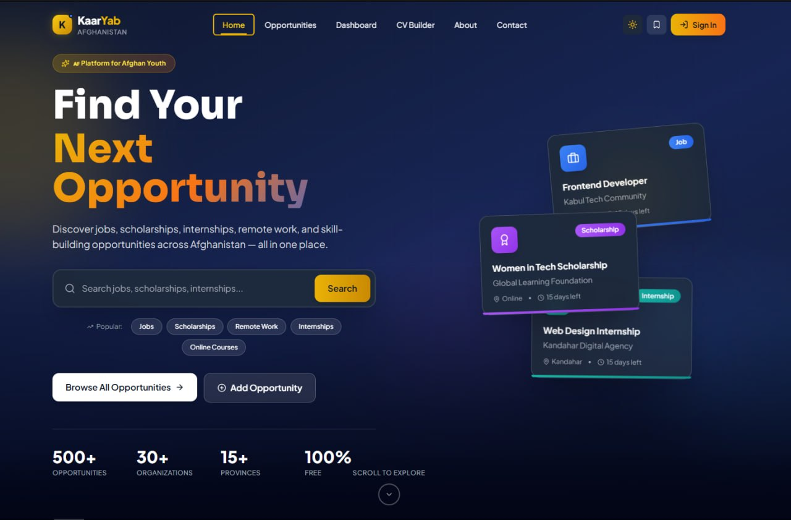
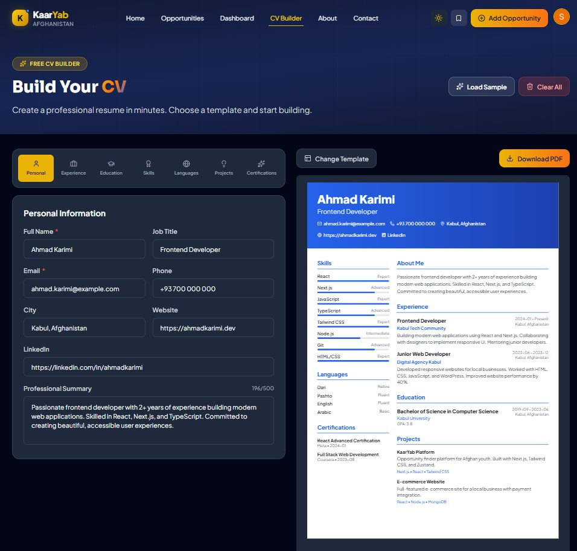
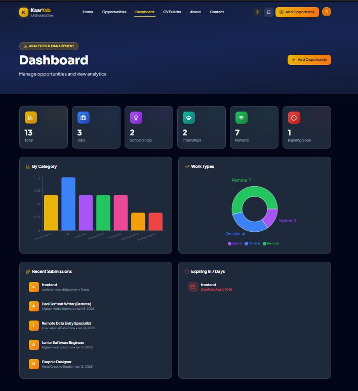

<div align="center">

# KaarYab Afghanistan

### Opportunity Finder Platform for Afghan Youth

[](https://nextjs.org/)
[](https://reactjs.org/)
[](https://tailwindcss.com/)
[](https://www.framer.com/motion/)
[](https://opensource.org/licenses/MIT)

**A modern web platform helping Afghan youth discover jobs, scholarships, internships, and skill-building opportunities across Afghanistan.**

[Live Demo](https://kaaryab.vercel.app) •
[Report Bug](https://github.com/Somaiyanoori/kaaryab-afghanistan/issues) •
[Request Feature](https://github.com/Somaiyanoori/kaaryab-afghanistan/issues)

</div>

---

# Screenshots

<div align="center">

### Home Page

_Add screenshot: `/public/screenshots/home.png`_

### Browse Opportunities

_Add screenshot: `/public/screenshots/opportunities.png`_

### CV Builder

_Add screenshot: `/public/screenshots/cv-builder.png`_

### Dashboard

_Add screenshot: `/public/screenshots/dashboard.png`_

### Dark Mode

_Add screenshot: `/public/screenshots/dark-mode.png`_

</div>

---

# About the Project

**KaarYab Afghanistan** is a comprehensive opportunity finder platform designed to empower Afghan youth by connecting them with jobs, scholarships, internships, and educational opportunities across Afghanistan and beyond.

## The Problem

Information about jobs, scholarships, and internships is scattered across social media, websites, and word of mouth. Many talented young people miss valuable opportunities because they never discover them.

## The Solution

KaarYab provides a single platform where users can:

- Discover opportunities in one place
- Save opportunities for later
- Build professional CVs
- Apply directly using official links
- Access the platform in multiple languages

---

# Features

## Modern User Interface

- Responsive design
- Dark mode support
- Mobile-first layout
- Afghan-inspired color palette
- Smooth animations

## Search & Filtering

- Real-time search
- Category filtering
- Location filtering
- Work type filtering
- Deadline filtering
- Grid/List views

## Opportunity Management

- Seven opportunity categories
- Detailed opportunity pages
- Countdown timers
- Social sharing
- Save favorites using LocalStorage

## Dashboard

- Analytics charts
- Statistics cards
- Recent activity
- Expiring opportunities

## CV Builder

- Four professional templates
- Live preview
- PDF export
- Experience
- Education
- Skills
- Languages
- Projects
- Certifications

## Forms

- Add opportunities
- Edit opportunities
- Delete opportunities
- Live preview
- Zod validation

## Additional Features

- Sample opportunities
- Testimonials
- FAQ
- Newsletter
- Custom 404 page
- Error pages

---

# Built With

| Technology | Purpose | Version |
|------------|---------|---------|
| Next.js | React Framework | 16.2 |
| React | UI Library | 19.2 |
| Tailwind CSS | Styling | 3.4 |
| Framer Motion | Animations | 12.4 |
| Zustand | State Management | 5.0 |
| React Hook Form | Form Handling | 7.x |
| Zod | Validation | 4.x |
| Recharts | Charts | 3.x |
| Lucide React | Icons | Latest |
| React Icons | Icons | Latest |
| Next Themes | Theme Switching | Latest |
| React Hot Toast | Notifications | Latest |
| date-fns | Date Utilities | Latest |
| html2canvas | Image Capture | Latest |
| jsPDF | PDF Generation | Latest |

---

# Getting Started

## Prerequisites

- Node.js 18+
- npm, yarn, or pnpm

## Installation

### Clone the repository

```bash
git clone https://github.com/Somaiyanoori/kaaryab-afghanistan.git

cd kaaryab-afghanistan
```

### Install dependencies

```bash
npm install
```

### Start the development server

```bash
npm run dev
```

Open:

```
http://localhost:3000
```

## Production Build

```bash
npm run build
npm start
```

---

# Project Structure

```text
kaaryab-afghanistan/
│
├── app/
│   ├── page.jsx
│   ├── layout.jsx
│   ├── globals.css
│   ├── loading.jsx
│   ├── error.jsx
│   ├── not-found.jsx
│   │
│   ├── opportunities/
│   ├── saved/
│   ├── dashboard/
│   ├── cv-builder/
│   ├── add-opportunity/
│   ├── edit-opportunity/
│   ├── about/
│   └── contact/
│
├── components/
│   ├── layout/
│   ├── home/
│   ├── opportunities/
│   ├── dashboard/
│   ├── cv-builder/
│   ├── forms/
│   ├── shared/
│   └── states/
│
├── store/
├── lib/
├── data/
├── hooks/
├── public/
│
├── tailwind.config.js
├── next.config.mjs
├── postcss.config.js
└── package.json
```

---

# Design System

## Colors

| Purpose | Color |
|---------|-------|
| Opportunity | `#EAB308` |
| Trust | `#2563EB` |
| Success | `#16A34A` |

### Category Colors

| Category | Color |
|----------|-------|
| Job | `#2563EB` |
| Internship | `#0D9488` |
| Scholarship | `#9333EA` |
| Online Course | `#4F46E5` |
| Remote Work | `#16A34A` |
| Training | `#D97706` |
| Volunteer | `#DB2777` |

## Typography

- Plus Jakarta Sans
- Sora
- Noto Naskh Arabic (RTL)

## Layout

- Mobile-first responsive design
- Maximum container width: 1280px

---

# Pages

| Route | Description |
|--------|-------------|
| `/` | Home |
| `/opportunities` | Browse Opportunities |
| `/opportunities/[id]` | Opportunity Details |
| `/saved` | Saved Opportunities |
| `/add-opportunity` | Add Opportunity |
| `/edit-opportunity/[id]` | Edit Opportunity |
| `/dashboard` | Dashboard |
| `/cv-builder` | CV Builder |
| `/about` | About |
| `/contact` | Contact |

---

# License

This project is licensed under the MIT License.
---

# Key Highlights

## Performance

- Fast page loads using Next.js App Router
- Optimized bundle size with dynamic imports
- Code splitting for CV templates
- Lazy loading for images

---

## Accessibility

- Semantic HTML throughout the application
- Full keyboard navigation support
- High color contrast for better readability
- Screen reader friendly
- Right-to-left (RTL) language support

---

## Developer Experience

- ESLint configuration included
- Prettier support
- Custom design system
- Well-organized component architecture
- Hot Module Replacement (HMR)

---

# Future Enhancements

The following features are planned for future releases:

- Backend integration with a real database
- User authentication (Login & Registration)
- Real-time notifications
- Admin dashboard for opportunity management
- Email notifications for saved opportunities
- AI-powered search
- Mobile application using React Native
- Multi-language support (Dari and Pashto)
- Analytics and tracking
- Employer accounts

---

# Contributing

Contributions are welcome and appreciated.

If you would like to contribute, please follow these steps:

1. Fork this repository.

2. Create a new branch.

```bash
git checkout -b feature/AmazingFeature
```

3. Commit your changes.

```bash
git commit -m "Add AmazingFeature"
```

4. Push the branch.

```bash
git push origin feature/AmazingFeature
```

5. Open a Pull Request.

---

# License

This project is distributed under the MIT License.

See the `LICENSE` file for more information.

---

# Author

**Somaiya Noori**

GitHub Profile

https://github.com/Somaiyanoori

Project Repository

https://github.com/Somaiyanoori/kaaryab-afghanistan

---

# Acknowledgments

This project was inspired by the need to provide Afghan youth with a centralized platform for discovering opportunities.

Special thanks to:

- The open-source community
- Next.js
- React
- Tailwind CSS
- Framer Motion
- Recharts
- Lucide React
- React Icons
- Google Fonts

---

# Disclaimer

This platform was created for educational and portfolio purposes.

All opportunities displayed in this project are sample data and do not represent real job, scholarship, internship, or training opportunities.

For official opportunities, please refer to trusted organizations and verified sources.

---

# Screenshots

Create the following folder inside the project:

```text
public/
└── screenshots/
    ├── home.png
    ├── opportunities.png
    ├── cv-builder.png
    ├── dashboard.png
    └── dark-mode.png
```

Then add the screenshots to the README.

## Home Page

```md

```

## Opportunities

```md

```

## CV Builder

```md

```

## Dashboard

```md

```

## Dark Mode

```md

```

---

## Publishing

```bash
git add README.md
git commit -m "docs: improve README"
git push
```
